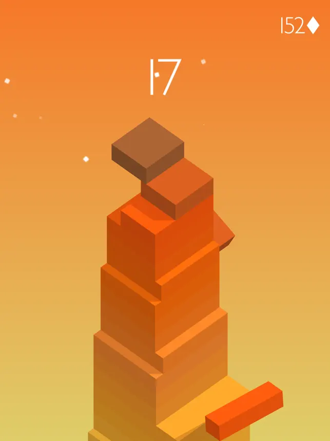
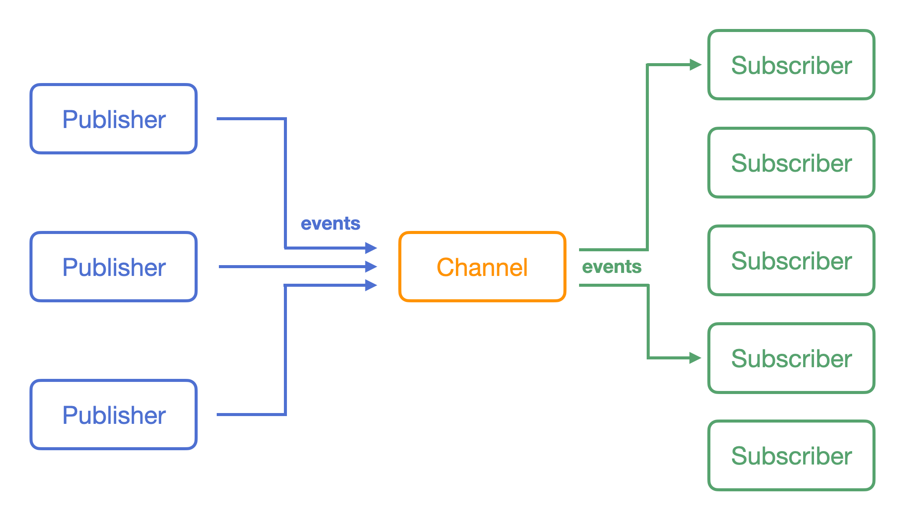
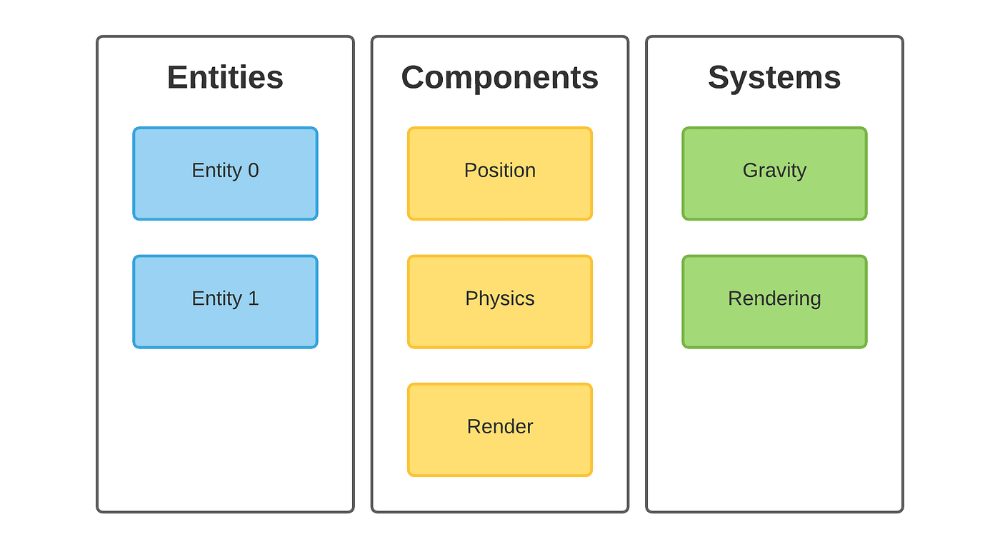

+++
title = 'Cenote'
date = 2024-08-25T19:35:35-04:00
draft = false
image = 'gameplay.png'
categories = [ 'Projects' ]
tags = [ 'game-development', 'game-jams' ]
[[links]]
title = "Cenote"
description = 'Click here to play on itch.io'
website = 'https://stavguo.itch.io/cenote'
image = 'cover.png'
+++
I recently participated in the GMTK 2024 Game Jam to experiment with creating a full game quickly. This was a departure from my usual workflow, where I spend several weeks on a prototype, add new features, and then lose interest before the project is complete enough to be presented. As Leonardo da Vinci said, “Art is never finished, only abandoned.”

On the first day of the Jam, I brainstormed ideas to best address the theme: Built to Scale. My top priorities were to keep the game’s core mechanic simple and fun. My first idea was to create a game similar to the popular iOS game “Stack,” where players use precise timing to stack moving blocks and scale upwards. This evolved into helping an entity reach a certain height by building a path. Given the time constraints and my unfamiliarity with Godot’s AI systems, I inverted the controls: the player would control the character, and the path would be built randomly by falling blocks. I took inspiration from the game [Catherine: Full Body](https://en.wikipedia.org/wiki/Catherine_(video_game)).

 

I’m glad the game jam only lasted the weekend because my Godot project quickly became unwieldy. When I first got into game development in college, I leveraged the Publish-subscribe pattern to communicate between my game objects. I liked its decoupled simplicity, but it didn’t scale well and was tricky to debug, especially timing the order in which subscribers reacted to events. Later, I grew to enjoy the entity component system (ECS). Even with a rapidly growing codebase, it felt organized and concise. My biggest gripe with ECS is the overhead with things like the user interface, which had to be handled by manually switching flags—something that could be easily managed with a state machine.

 

However, Godot relies heavily on inheritance and “scenes” with its node system. I appreciate that Godot provides many components typically used in games (Sprites, TileMaps, etc.), which sped up the tedious parts of development during this game jam. However, it is recommended to use signals for nodes to communicate with their siblings or parents. Unlike very decoupled patterns like Pub-Sub, you have to either manually connect nodes via the editor or bind functions to signals via code, which requires knowing the paths of both entities, thereby coupling them.

Ultimately, I released the game in a complete, playable, albeit slightly buggy state. Cenote ranked #2859 out of 7636 entries. I wish I had started sooner and not had to pivot game ideas mid-implementation, which would have allowed me to include audio, better art, and a more polished experience. If I ever get around to making a remake, I would like to add power-ups that fall alongside the blocks, as well as a “final boss” in the form of an entity identical to the player that tries to sabotage you.

You can play the game on [itch.io](https://stavguo.itch.io/cenote).
<iframe frameborder="0" src="https://itch.io/embed/2910348" width="552" height="167"><a href="https://stavguo.itch.io/cenote">Cenote by stavguo</a></iframe>