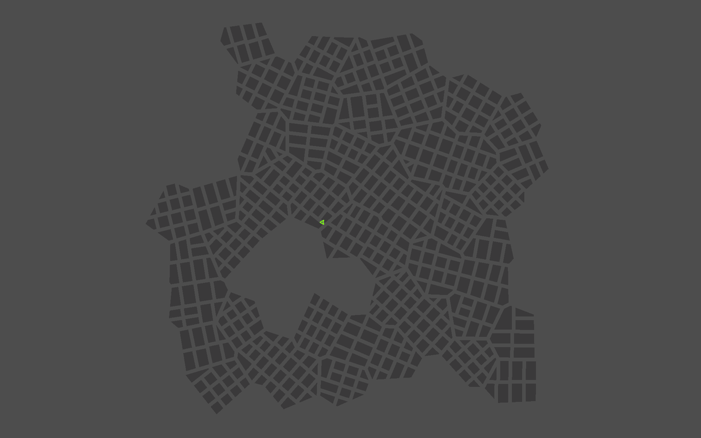

+++
title = 'Procedurally Generated City using Computational Geometry'
categories = [ "Projects" ]
date = 2023-11-12T00:00:00-05:00
draft = false
image = 'cover.png'
+++

I started this project shortly after I wrapped up my [Object Aligned Bounding Box (OBB) implementation]('https://stavguo.github.io/post/obb/'). I wanted to synthetically create a city layout (comprised solely of streets and buildings) that felt organic by combining several ideas: [Poisson disk sampling]('https://en.wikipedia.org/wiki/Supersampling#Poisson_disk'), [Voronoi diagrams]('https://en.wikipedia.org/wiki/Voronoi_diagram'), and OBB.

Firstly, Poisson disk sampling is used because it is an efficient way of generating random points throughout a two-dimensional space while still retaining control of the minimum amount of space between any two random points. If I just randomly selected points, there could figuratively be microscopic buildings if two points were too close together.

Once I have my points, I use the [Bowyer–Watson algorithm]('https://en.wikipedia.org/wiki/Bowyer%E2%80%93Watson_algorithm') to compute the [Delaunay triangulation]('https://en.wikipedia.org/wiki/Delaunay_triangulation') of my finite set of points. Using the triangulation, I can obtain my Voronoi diagram since it is the [dual graph]('https://en.wikipedia.org/wiki/Dual_graph') of the Delaunay triangulation. I then pass the Voronoi site as the polygon to be parceled by [my OBB parceling implementation](https://github.com/stavguo/obb-parcelling).

Lastly, I assign each polygon's centroid a value using [Simplex noise]('https://en.wikipedia.org/wiki/Simplex_noise'), and sort them in descending order. I get to control what proportion of the polygons are parceled, meaning the lowest value ones get discarded. This way, each render gets some interesting island shapes, lakes, peninsulas, etc.

