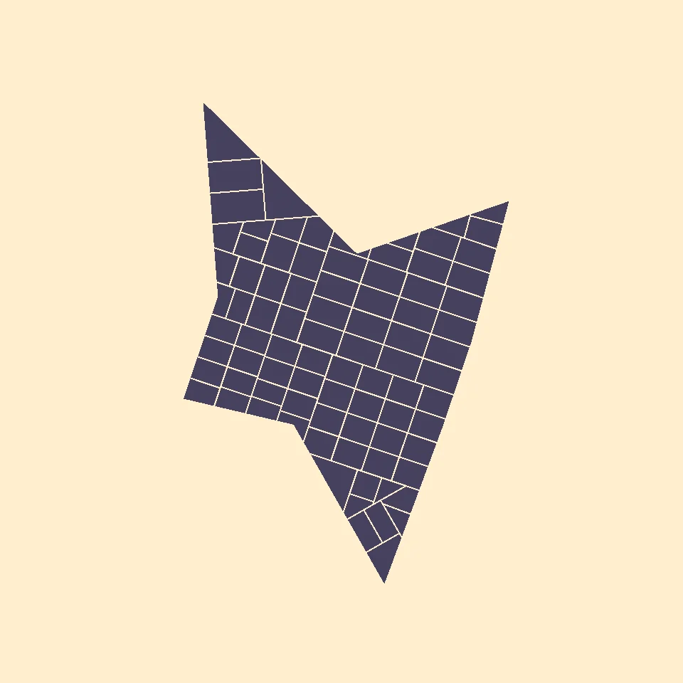
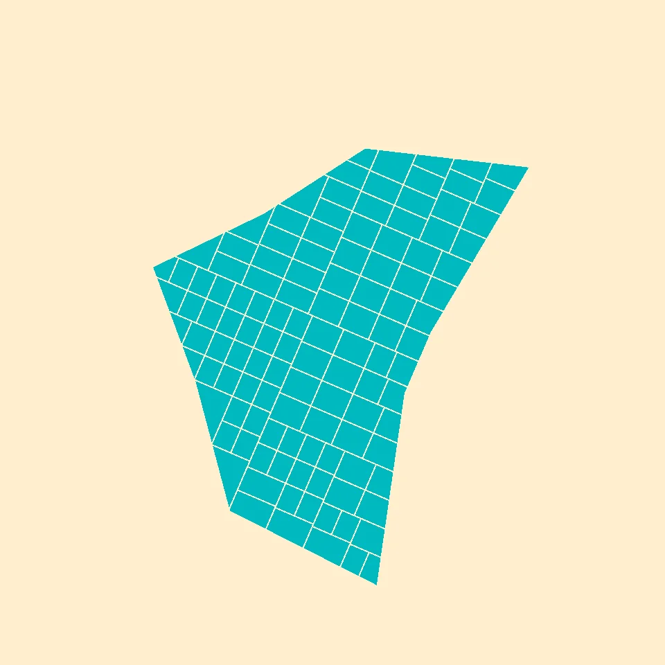
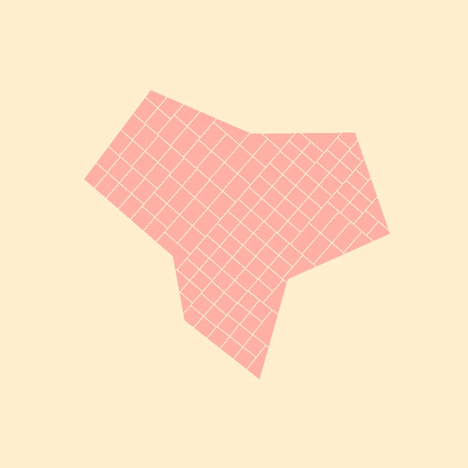

+++
title = 'Procedural Parcel Generation of City Blocks using OBB (Object Aligned Bounding Box) Parcelling'
categories = [ "Projects" ]
tags = [ 'game-development', 'computational-geometry' ]
date = 2023-10-15T00:00:00-05:00
draft = false
image = 's1.webp'
[[links]]
title = 'OBB (Object Aligned Bounding Box) Parcelling'
website = 'https://github.com/stavguo/obb-parcelling'
+++

This project started when I found [jphsd's reddit post](<https://www.reddit.com/r/proceduralgeneration/comments/167mfpb/neighborhood_subdivision/>) on [r/proceduralgeneration](<https://www.reddit.com/r/proceduralgeneration/>). I wanted to find a way to create similarly convincing, realistic city layouts. As I was researching, I found a very helpful [blog post](<https://martindevans.me/game-development/2015/12/27/Procedural-Generation-For-Dummies-Lots/>) by Martin Evans which described the pseudocode for OBB (Object Aligned Bounding Box) Parcelling. Evans came upon OBB in this [paper](<https://www.cs.purdue.edu/cgvlab/papers/aliaga/eg2012.pdf>) by Carlos A. Vanegas, Tom Kelly, Basil Weber, Jan Halatsch, Daniel G. Aliaga, and Pascal Müller. What interested me the most of this algorithm is that you can feed it any kind of [simple polygon](<https://en.wikipedia.org/wiki/Simple_polygon>), and it'll create believable city blocks.  

 
 

I used Godot, an open source game engine, to implement the OBB algorithm to procedurally generate parcels of city blocks within a scene. My project can be found [here](<https://github.com/stavguo/obb-parcelling>). I chose to use Godot instead of Unity due to it being open source and actively developed, as well as its comprehensive Geometry2D API and procedural mesh generation using the SurfaceTool API. For creating the initial simple polygon to be parcelled, I used a method I found in this [Stack Overflow post](<https://stackoverflow.com/a/8997139>). First, random points are selected along differently sized circles with the same center, and then connect these points in a clockwise order to create snowflake-shaped simple polygons. Then an object aligned bounding box is used to recursively subdivide the polygon into two halves. The recursion concludes once a parcel has reached a certain size.

My hope for this project is to lay the groundwork for a game or simulation to efficiently procedurally generate organic cities.